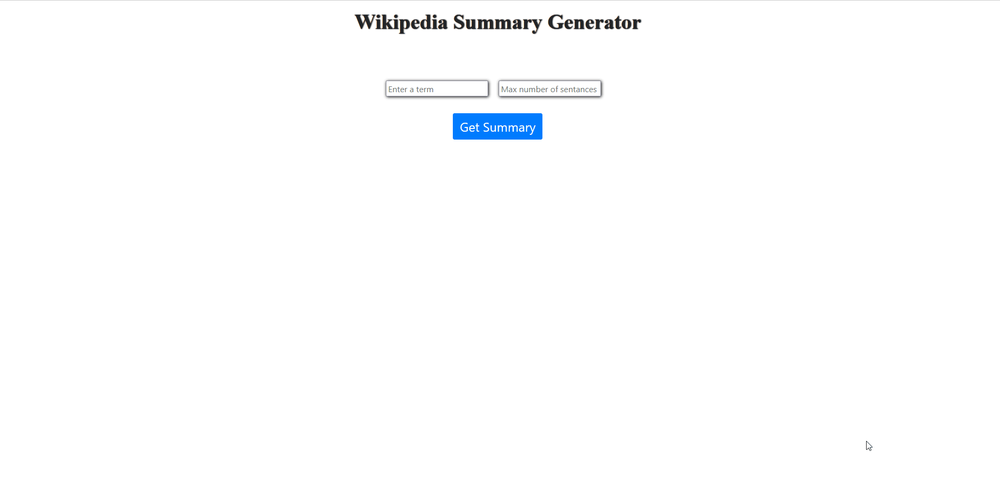

# Flask-Wikipedia
Using  Flask and the wikipedia python library users can enter a term and a max number of sentences they want their summary to be
 and then get a summary on that matches their term and specified length.
## Demo
